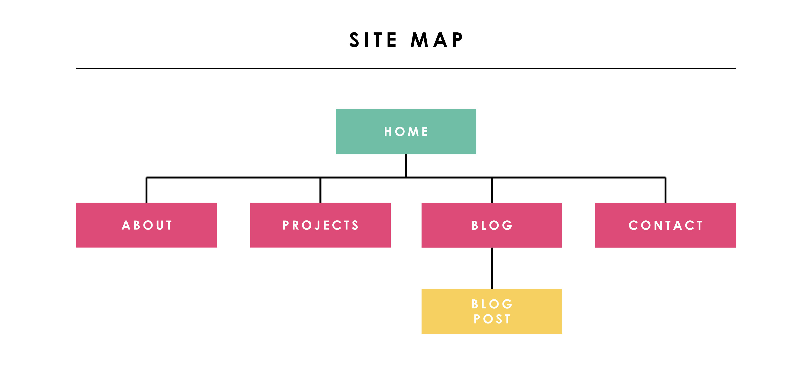
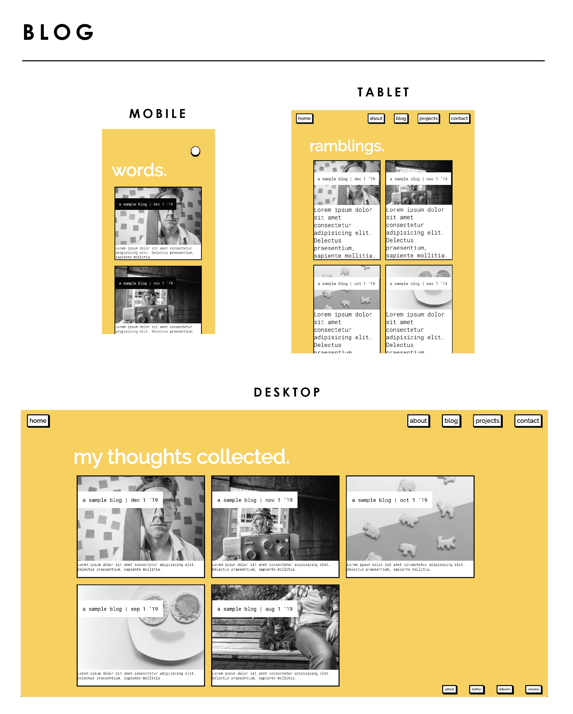

# Louise Flanagan - Portfolio Website

Deployed site: https://lou-flan.github.io/portfolio-site/

Remote repository: https://github.com/Lou-Flan/portfolio-site

------

### **Description**

This repository contains my first online portfolio written in HTML and SCSS. The repo contains all source files and presentation slides with initial wireframe designs and design choice explanations.

**Brief**

Create a portfolio website which presents you as a dev and IT professional. The purpose is to provide an online portfolio that provides information about you, your skills, interests, professional knowledge and a showcase of your work.

### **Purpose**

The purpose of this website, is to showcase my current programming skills and projects to potential employers. It is also intended to provide a means of contact and an insight into my personality.

------

### **Functionality / Features**

The website features several key pages, all with responsive design implemented for optimum viewing on mobile, tablet and desktop. All pages are accessible from the navigation menu at the top of the page and links to my social accounts and resume can be found in the footer of each page.

All pages feature responsive layout design utilising flexbox and media queries, image hover animations and text animations. Consistent use of two imported Google fonts with specific fallback options for each.

**Site-Wide Features**

- Responsive, animated titles offering alternate messaging based on the width of the viewport.

- A range of image hover effects, from cartoon image overlay to greyscale/colour switching.

- Animated, highlighted text for paragraph emphasis.

- Consistent use of design elements including, colours, fonts and box-shadow styling.

- Three button background colour selector utilising radio buttons with transforming backgrounds.

**Page Specific Features**

- About 
  - Diagram of my preferences, created with CSS.
- Projects
  - Two recent projects including title, tech stack and description.
- Blog
  - Five sample blogs including title, date of publication and sample text.

Alternative versions of the site, including font changes and different colour scheme can be found in repo the branches.

------

### **Sitemap**

------

### **Screenshots**

------
### **Target Audience**

The target audience is potential employers from creative tech companies in Sydney. 

------

### **Tech Stack**

For this project, I utilised the following technologies:

- Balsamiq (Mockups)
- Adobe Illustrator & Photoshop

- HTML5
- CSS3
- SASS
- Git & GitHub
- GitHub io deployment platform